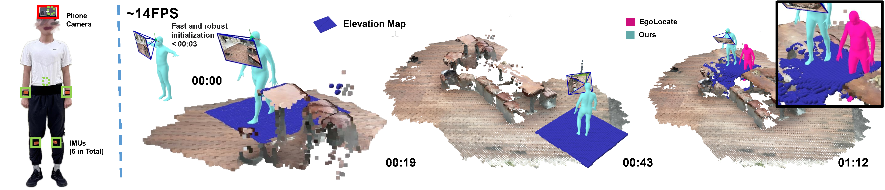

# EgoHDM
[Paper](https://arxiv.org/abs/2409.00343) | [Project Page](https://handiyin.github.io/EgoHDM/) | [Video](https://www.youtube.com/watch?v=L6BIrTWWy_Y)
Official code release for the following paper:
"**EgoHDM: An Online Egocentric-Inertial Human Motion Capture, Localization, and Dense Mapping System**"

We present an egocentric-inertial human motion capture system that simultaneously estimates a dense map of the scene, runs in near real-time, and is fast and robust to initialize. The system takes as input 6 body-worn IMUs and a head-worn RGB camera. It achieves unprecedented accuracy in terms of localization and mapping, and adapts better to non-flat terrain than previous work thanks to physics-based corrections leveraging a local elevation map.